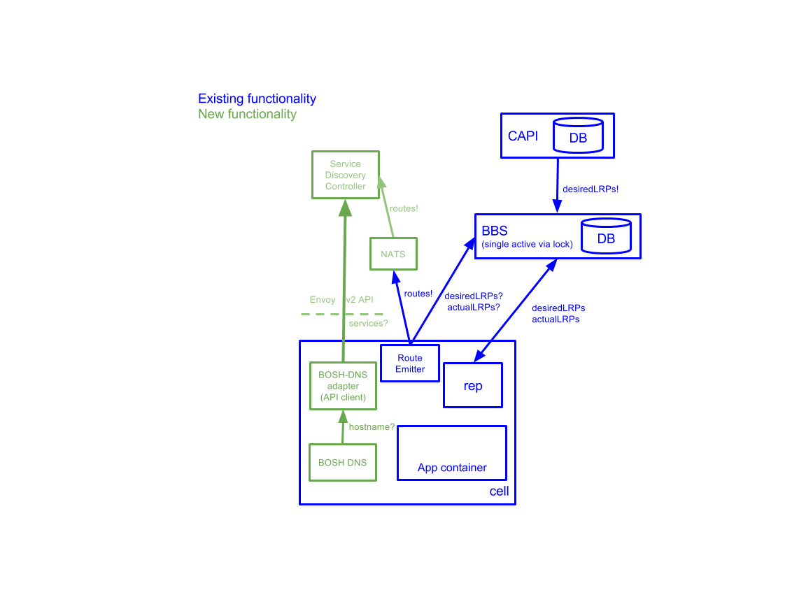

# CF App Service Discovery Release (EXPERIMENTAL)


## High Level Overview

### Problem we are trying to solve
Application Developers who want to use container to container networking today are required to bring their own service discovery. While we have provided examples with Eureka and Amalgam8, we have received user feedback that usage of c2c is very difficult, with some common themes emerging:
Polyglot microservices written in languages/frameworks other than Java/Spring cannot easily use Eureka
Clustering applications have a requirement to address individual instances
Additional VMs need to be deployed and managed to provide external service discovery

In order to support all types of apps, languages and frameworks, we plan to build service discovery for c2c into the platform. With this feature, users will no longer have to bring their own service discovery. 

### App Developer Experience

When a user pushes an app, their app is automatically given an internal DNS entry, e.g.
```
app-guid.sd-tld
```
This DNS entry will automatically load balance between all instances of this app.

Each instance of the application also receives a specific DNS entry, e.g.
```
instance-index.app-guid.sd-tld
```
that you can use to access one instance of the app, so it will not load balance between all instances.

### Interaction with Policy

By default, apps cannot talk to each other over cf networking. In order for an app to talk to another app, you must still set a policy allowing access. 

### Example usage

```
cf push consumer-app --no-start
cf push server-app

cf allow-access consumer-app server-app --port 808 --protocol tcp

cf set-env consumer SERVER_HOSTNAME "$(cf app --guid server-app).sd-local
cf start consumer-app
```

You can run `cf allow-access` even after both apps are started, and you don't need to restart the apps for the policy to start working.

From consumer-app, the following will work:
```
curl $SERVER_HOSTNAME.sd-local:8080
```

## Architecture

### Architecture Diagram


## How To Deploy

### Link to Experimental Ops File for cf-deployment (Coming Soon)

### Deploying to cf-release (Coming Soon)

### Deploying to BOSH-lite
Run the [`scripts/deploy-to-bosh-lite`](scripts/deploy-to-bosh-lite) script. Note this requires [cf-networking-release](https://github.com/cloudfoundry/cf-networking-release), [bosh-deployment](https://github.com/cloudfoundry/bosh-deployment), and [cf-deployment](https://github.com/cloudfoundry/cf-deployment)
